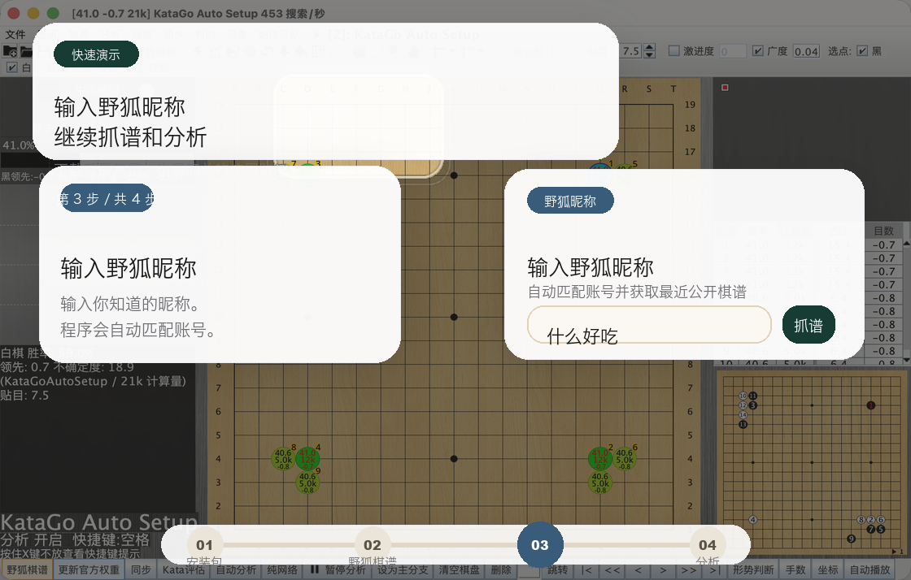
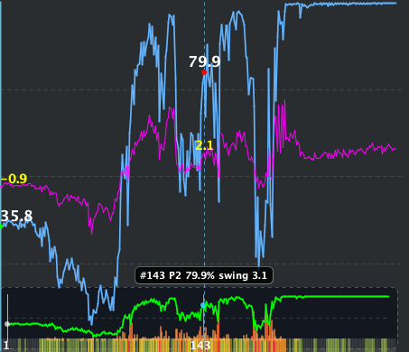

  

  
  
  
  

  中文 · <a href="README_EN.md">English</a> · <a href="README_JA.md">日本語</a> · <a href="README_KO.md">한국어</a>

  <strong>LizzieYzy Next 是当前仍在维护的 lizzieyzy 维护版，也是一个面向普通用户的 KataGo 围棋复盘 GUI。</strong> 
  这个项目现在只做几件最重要的事：下载更好选、首次启动更省心、野狐抓谱继续可用、复盘时更快看出问题手。 
  <strong>下载安装，输入野狐昵称，就能抓最近公开棋谱、做快速全盘分析，并用新版胜率图和底部快速概览更快定位关键手。</strong>

  <a href="https://github.com/wimi321/lizzieyzy-next/releases"><strong>下载发布包</strong></a>
  ·
  <a href="docs/INSTALL.md"><strong>安装说明</strong></a>
  ·
  <a href="docs/TROUBLESHOOTING.md"><strong>常见问题</strong></a>

> [!TIP]
> 项目讨论 QQ 群：`299419120`
>
> 欢迎交流使用问题、反馈 bug、讨论功能，或者一起继续维护这个项目。

> [!IMPORTANT]
> 如果你只看首页，先记住这 6 句：
> - Windows 大多数用户：到 [Releases](https://github.com/wimi321/lizzieyzy-next/releases) 下载 `*windows64.opencl.portable.zip`
> - 如果你的电脑有 NVIDIA 显卡并且想更快：下载 `*windows64.nvidia.portable.zip`
> - 如果 OpenCL 在你的电脑上不稳定：下载 `*windows64.with-katago.portable.zip`
> - 现在支持直接输入野狐昵称抓最近公开棋谱，不需要先查账号数字
> - 主推荐整合包已内置 KataGo `v1.16.4` 和官方推荐 `zhizi` 权重 `kata1-zhizi-b28c512nbt-muonfd2.bin.gz`
> - 主发布包已内置 `readboard_java`，多数用户不需要再单独找 readboard 仓库

## 这是什么项目

`LizzieYzy Next` 可以直接理解成：

- 一个面向普通用户的 `KataGo 围棋复盘软件`
- 一个还在持续维护的 `lizzieyzy 维护版 / 替代项目`
- 一个把 `野狐抓谱 + KataGo 分析 + 免安装发布包 + 默认权重` 整合到一起的桌面工具

如果你在找的是这些东西，这个项目就应该优先看：

- `KataGo 围棋复盘软件`
- `KataGo GUI`
- `lizzieyzy 维护版`
- `野狐棋谱抓取 + KataGo 复盘`
- `Windows 免安装围棋 AI 复盘工具`

## 现在已经能做什么

| 你想做什么 | 这个项目现在怎么解决 |
| --- | --- |
| 抓最近公开野狐棋谱 | 直接输入野狐昵称，程序自动匹配账号并抓谱 |
| 快速看整盘走势 | 提供快速全盘分析，不用完全靠一步一步手点 |
| 快速找问题手 | 提供新版主胜率图和底部热力概览，更容易一眼看出大问题手 |
| 少折腾配置 | 推荐整合包已内置 KataGo、默认权重和首次自动配置 |
| 不想安装 | Windows 默认优先推荐 `portable.zip` 免安装包 |
| 做棋盘同步 | 主发布包已内置 `readboard_java` 简易同步工具 |

## 先下载哪个

所有下载都在 [Releases](https://github.com/wimi321/lizzieyzy-next/releases)。下表里的文件名关键字，在最新 release 页面里都能找到。

  

| 你的情况 | 到 Releases 里找包含这个关键词的文件 |
| --- | --- |
| Windows 大多数用户，推荐，免安装 | `*windows64.opencl.portable.zip` |
| Windows，OpenCL 版，想安装 | `*windows64.opencl.installer.exe` |
| Windows，OpenCL 不稳定，CPU 兼容兜底，免安装 | `*windows64.with-katago.portable.zip` |
| Windows，CPU 兼容兜底，想安装 | `*windows64.with-katago.installer.exe` |
| Windows，NVIDIA 显卡，想更快，免安装 | `*windows64.nvidia.portable.zip` |
| Windows，NVIDIA 显卡，想安装 | `*windows64.nvidia.installer.exe` |
| Windows，自己配引擎，免安装 | `*windows64.without.engine.portable.zip` |
| Windows，自己配引擎，想安装 | `*windows64.without.engine.installer.exe` |
| macOS Apple Silicon | `*mac-arm64.with-katago.dmg` |
| macOS Intel | `*mac-amd64.with-katago.dmg` |
| Linux | `*linux64.with-katago.zip` |

如果你懒得分辨：

- Windows：先下 `*windows64.opencl.portable.zip`
- Windows + NVIDIA 显卡：先下 `*windows64.nvidia.portable.zip`
- OpenCL 不稳定：改下 `*windows64.with-katago.portable.zip`
- Mac：先分清 Apple Silicon 还是 Intel
- Linux：直接下 `*linux64.with-katago.zip`

## 为什么这一版现在值得优先看

- `野狐抓谱能继续用`
  现在支持直接输入野狐昵称，普通用户不用先查数字账号。
- `快速全盘分析已经是主流程`
  打开棋谱后，可以更快得到整盘走势，而不是完全依赖一步一步手动分析。
- `新版主胜率图 + 底部快速概览`
  更容易看出哪里是大恶手，哪里值得先回头看。
- `Windows 免安装优先`
  普通用户下载更直接，OpenCL / NVIDIA / CPU 三条线也更清楚。
- `主项目直接内置 readboard_java`
  多数用户不需要再单独找 readboard 仓库来拼环境。
- `真实发布 + 真实烟测`
  不是只改源码，Windows / macOS / Linux 的发布包和烟测链路也都持续在做。

## 三步开始

1. 去 [Releases](https://github.com/wimi321/lizzieyzy-next/releases) 下载适合自己系统的包。
2. 打开程序后，点击 `野狐棋谱`，输入野狐昵称。
3. 抓到棋谱后继续做快速全盘分析，用主胜率图和底部快速概览直接定位关键手。

  

  如果 GitHub 里的动图加载慢，直接点上面的图就能看完整演示。

## 当前真实界面

下面这张就是当前 release 的真实界面截图，不是旧版本历史图。

  

主胜率图和底部快速概览现在可以这样理解：

  

- 蓝线 / 紫线：双方胜率走势
- 绿色线：目差变化
- 底部热力概览：整盘问题手分布，红橙黄越多，越值得先看
- 竖向定位线：当前手或悬停手的位置

## 它和原来的 lizzieyzy 有什么区别

| 对比项 | 原 `lizzieyzy` | `LizzieYzy Next` |
| --- | --- | --- |
| 当前状态 | 历史项目，很多人还记得，但长期缺少持续维护 | 当前维护分支，继续修可用性和发布体验 |
| 野狐抓谱 | 老流程陆续失效 | 已恢复常用抓谱链路，支持昵称输入 |
| 输入方式 | 更依赖先知道账号数字 | 直接输入野狐昵称，程序自动匹配账号 |
| KataGo 使用门槛 | 常常需要自己补环境或补资源 | 推荐整合包已内置 KataGo 和默认权重 |
| Windows 下载体验 | 需要用户自己判断更多 | 明确优先推荐 `portable.zip` 免安装包 |
| 同步工具 | 用户自己拼环境的情况更多 | 主发布包直接带 `readboard_java` |

## 常见问题

### 棋盘同步工具还需要单独找 readboard 仓库吗？

多数用户不需要。`LizzieYzy Next` 现在把 `readboard_java` 当成主项目的一部分来交付，主发布包里直接带上了。

### 现在还需要先知道野狐账号数字吗？

不需要。现在直接输入野狐昵称就行，程序会自动匹配账号。

### 现在还要一步一步分析，才能看到整盘走势吗？

大多数情况下不需要。现在可以直接走快速全盘分析，主胜率图和底部快速概览会更快形成整盘视角。

### Mac 第一次打不开怎么办？

当前 macOS 包还没有做签名和公证。第一次被系统拦住时，按 [安装说明](docs/INSTALL.md) 里的步骤点“仍要打开”即可。

## 文档与交流

- [安装说明](docs/INSTALL.md)
- [发布包说明](docs/PACKAGES.md)
- [常见问题与排错](docs/TROUBLESHOOTING.md)
- [已验证平台](docs/TESTED_PLATFORMS.md)
- [项目路线图](ROADMAP.md)
- [参与贡献](CONTRIBUTING.md)
- [更新日志](CHANGELOG.md)
- [Support](SUPPORT.md)
- GitHub Discussions: <https://github.com/wimi321/lizzieyzy-next/discussions>
- QQ 群：`299419120`

## 致谢

- 原项目：[yzyray/lizzieyzy](https://github.com/yzyray/lizzieyzy)
- KataGo：[lightvector/KataGo](https://github.com/lightvector/KataGo)
野狐抓谱历史参考：
- [yzyray/FoxRequest](https://github.com/yzyray/FoxRequest)
- [FuckUbuntu/Lizzieyzy-Helper](https://github.com/FuckUbuntu/Lizzieyzy-Helper)
