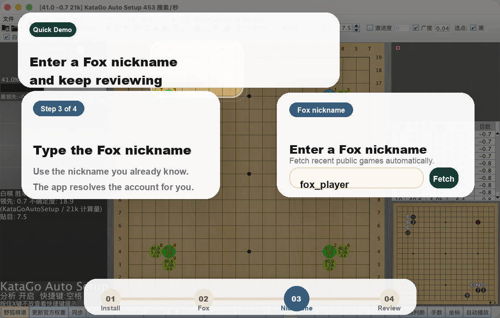

  

  
  
  
  

  <a href="README.md">中文</a> · English · <a href="README_JA.md">日本語</a> · <a href="README_KO.md">한국어</a>

  <strong>LizzieYzy Next is the actively maintained LizzieYzy fork and a practical KataGo review GUI for everyday players.</strong> 
  It focuses on the parts that actually affect the user experience: easier package selection, less painful first launch, Fox fetching that works again, and a whole-game view that is easier to read at a glance. 
  <strong>Download it, enter a Fox nickname, fetch recent public games, run fast full-game analysis, and use the redesigned winrate graph plus quick overview strip to jump to the key moves faster.</strong>

  <a href="https://github.com/wimi321/lizzieyzy-next/releases"><strong>Download Releases</strong></a>
  ·
  <a href="https://pan.baidu.com/s/1wthaL8YwGMxy_u0U7Mabpw?pwd=3i8w"><strong>Baidu Download</strong></a>
  ·
  <a href="docs/INSTALL_EN.md"><strong>Installation Guide</strong></a>
  ·
  <a href="docs/TROUBLESHOOTING_EN.md"><strong>Troubleshooting</strong></a>

> [!NOTE]
> For users in mainland China, a public Baidu Netdisk download is available:
> [https://pan.baidu.com/s/1wthaL8YwGMxy_u0U7Mabpw?pwd=3i8w](https://pan.baidu.com/s/1wthaL8YwGMxy_u0U7Mabpw?pwd=3i8w)
> Extraction code: `3i8w`

> [!TIP]
> Chinese QQ group: `299419120`
>
> It is the fastest place for day-to-day user feedback, bug reports, and feature discussion.

> [!IMPORTANT]
> If you only want the shortest possible answer, remember these 6 points:
> - Most Windows users should go to [Releases](https://github.com/wimi321/lizzieyzy-next/releases) and download `*windows64.opencl.portable.zip`
> - If your PC has an NVIDIA GPU and you want more speed, download `*windows64.nvidia.portable.zip`
> - If OpenCL behaves badly on your PC, switch to `*windows64.with-katago.portable.zip`
> - The app now supports Fox nickname input directly, so most users no longer need the account number first
> - The main bundles include KataGo `v1.16.4` and the official recommended `zhizi` weight `kata1-zhizi-b28c512nbt-muonfd2.bin.gz`
> - Main release packages now ship the `readboard_java` helper, so most users do not need a separate readboard repository

## Why Many Users Start Here

`LizzieYzy Next` is:

- an actively maintained `KataGo review desktop app`
- a practical workflow that combines `Fox fetching + fast whole-game analysis + multi-platform release packages`
- the maintained branch that makes it easier for long-time `lizzieyzy` users to keep going without rebuilding their setup

If you are searching for these things, this is the project to check first:

- `KataGo review software`
- `KataGo GUI`
- `LizzieYzy maintained fork`
- `Fox game fetch + KataGo review`
- `portable Windows Go AI review tool`

## What You Can Do Right Away

| What you want | How the project handles it now |
| --- | --- |
| Fetch recent public Fox games | Enter a Fox nickname and let the app resolve the account automatically |
| See the whole game faster | Use fast full-game analysis instead of relying only on move-by-move clicking |
| Find problem moves faster | Use the redesigned main winrate graph and the bottom heat overview strip |
| Avoid setup work | Use bundled KataGo, bundled weight, and first-launch auto setup |
| Avoid installation | Use the portable Windows packages |
| Use board sync | Use the built-in `readboard_java` helper in the main release packages |

## What To Download First

All downloads are on [Releases](https://github.com/wimi321/lizzieyzy-next/releases). The table below uses filename keywords you can match on the latest release page.

  

| Your situation | Find the file that contains this keyword on Releases |
| --- | --- |
| Most Windows users, recommended, no installer | `*windows64.opencl.portable.zip` |
| Windows, OpenCL build, installer option | `*windows64.opencl.installer.exe` |
| Windows, OpenCL is unstable, CPU fallback, no installer | `*windows64.with-katago.portable.zip` |
| Windows, CPU fallback, installer option | `*windows64.with-katago.installer.exe` |
| Windows, NVIDIA GPU, faster analysis, no installer | `*windows64.nvidia.portable.zip` |
| Windows, NVIDIA GPU, installer option | `*windows64.nvidia.installer.exe` |
| Windows, bring your own engine, no installer | `*windows64.without.engine.portable.zip` |
| Windows, bring your own engine, installer option | `*windows64.without.engine.installer.exe` |
| macOS Apple Silicon | `*mac-arm64.with-katago.dmg` |
| macOS Intel | `*mac-amd64.with-katago.dmg` |
| Linux | `*linux64.with-katago.zip` |

Quick rule:

- Windows: start with `*windows64.opencl.portable.zip`
- Windows + NVIDIA GPU: start with `*windows64.nvidia.portable.zip`
- OpenCL unstable: switch to `*windows64.with-katago.portable.zip`
- Mac: choose Apple Silicon or Intel first
- Linux: choose `*linux64.with-katago.zip`

## Why This Build Fits Real Users Better

- `Fox fetching works again`
  Users can enter the Fox nickname they already know instead of hunting for the numeric ID first.
- `Fast full-game analysis is now a main workflow`
  You can get a whole-game picture much sooner instead of building it move by move.
- `Redesigned winrate graph + bottom quick overview`
  It is easier to scan where the large losses happened.
- `Portable-first Windows releases`
  OpenCL, NVIDIA, and CPU fallback options are easier to understand at a glance.
- `Built-in readboard_java helper`
  Most users no longer need to assemble a second repo just to get board sync working.
- `Real releases + real smoke tests`
  The project is backed by actual multi-platform release builds and smoke testing, not just source changes.

## Start In 3 Steps

1. Download the right package from [Releases](https://github.com/wimi321/lizzieyzy-next/releases).
2. Open `Fox Kifu` and enter a Fox nickname.
3. Fetch the games, run fast full-game analysis, and use the graph plus overview to jump to important moves.

  

  If GitHub delays GIF playback, click the image above to open the full animation.

## Actual Interface

This is the current maintained build, not an old historical screenshot.

  

You can read the main graph area like this:

  

- blue / magenta lines: the changing winrate picture
- green line: score lead changes
- bottom heat strip: where the whole game has the biggest mistakes
- vertical guide line: the current move or hovered move position

## How It Differs From The Original LizzieYzy

| Comparison | Original `lizzieyzy` | `LizzieYzy Next` |
| --- | --- | --- |
| Current status | Historical project remembered by many users, but without practical ongoing maintenance | Actively maintained branch focused on usability and releases |
| Fox fetching | Older flow broke for many users | Common fetching flow restored, now with nickname input |
| Input model | More dependent on knowing the account number first | Enter the Fox nickname and let the app resolve the account |
| KataGo setup barrier | Often means fixing your own environment | Recommended bundles already include KataGo and a default weight |
| Windows download experience | More guesswork for users | Clear portable-first recommendation |
| Board sync path | More manual assembly for users | Main release packages already include `readboard_java` |

## Common Questions

### Do I still need a separate readboard repository?

Most users do not. `LizzieYzy Next` now ships the `readboard_java` helper as part of the main release packages.

### Do I still need the Fox account number first?

No. In most cases you can enter the Fox nickname directly and let the app resolve the account.

### Do I still need to step move by move just to get a whole-game picture?

Usually no. The app now supports fast full-game analysis, so the main graph and quick overview can form much earlier.

### What if macOS blocks the app on first launch?

The current macOS builds are still unsigned and not notarized. If macOS blocks the app the first time, follow the steps in [Installation Guide](docs/INSTALL_EN.md).

## User Docs

- [Support Guide](SUPPORT.md)
- [Installation Guide](docs/INSTALL_EN.md)
- [Package Overview](docs/PACKAGES_EN.md)
- [Troubleshooting](docs/TROUBLESHOOTING_EN.md)
- [Tested Platforms](docs/TESTED_PLATFORMS.md)
- [GitHub Releases](https://github.com/wimi321/lizzieyzy-next/releases)
- GitHub Discussions: <https://github.com/wimi321/lizzieyzy-next/discussions>
- Chinese QQ group: `299419120`

## Project Links
- [Roadmap](ROADMAP.md)
- [Contributing](CONTRIBUTING.md)
- [Changelog](CHANGELOG.md)
- [Support](SUPPORT.md)

## Credits

- Original project: [yzyray/lizzieyzy](https://github.com/yzyray/lizzieyzy)
- KataGo: [lightvector/KataGo](https://github.com/lightvector/KataGo)
Historical Fox sync references:
- [yzyray/FoxRequest](https://github.com/yzyray/FoxRequest)
- [FuckUbuntu/Lizzieyzy-Helper](https://github.com/FuckUbuntu/Lizzieyzy-Helper)
