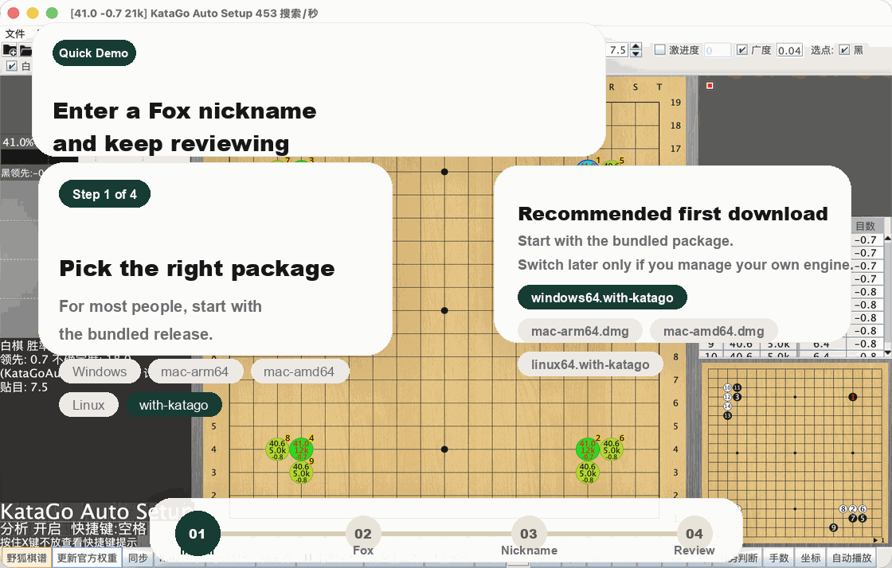

  

  
  
  
  
  
  

  <a href="README.md">中文</a> · English · <a href="README_JA.md">日本語</a> · <a href="README_KO.md">한국어</a>

  <strong>Restore the broken Fox sync path and make LizzieYzy practical again.</strong> 
  This maintained fork is for people who want to download the app, open it, fetch Fox games, and keep reviewing without turning first launch into a setup project. The app now centers on <strong>numeric Fox ID</strong>: digits only, not a nickname.

  <a href="https://github.com/wimi321/lizzieyzy-next-foxuid/releases">Download Releases</a>
  ·
  <a href="#one-page-overview">At A Glance</a>
  ·
  <a href="#what-to-download-first">Pick Your Download</a>
  ·
  <a href="#first-time-flow">First-Time Flow</a>
  ·
  <a href="#three-minute-setup">Three-Minute Setup</a>
  ·
  <a href="#release-assets">Release Assets</a>
  ·
  <a href="#docs-and-support">Docs & Support</a>

> [!IMPORTANT]
> If you just want the app to work after download, remember these 3 things:
> - Windows users should start with `windows64.with-katago.installer.exe`
> - Fox kifu fetch now expects a **numeric Fox ID**: digits only, no nickname
> - First launch tries to prepare the bundled analysis environment for you

## One-Page Overview

| What you care about | What this maintained fork now does |
| --- | --- |
| Can I install it and open it without fuss? | Windows leads with `installer.exe`, macOS leads with `.dmg`, Linux keeps one practical bundled zip |
| Can I still fetch Fox games? | Yes. The broken public-game sync path is restored and maintained |
| What am I supposed to type? | The UI now says **numeric Fox ID** everywhere, and it clearly says digits only, no nickname |
| Will first launch get stuck on setup? | The app prepares the bundled analysis environment first, so most users can start immediately |
| Is this just a one-off patch? | No. This repo exists to keep shipping releases, docs, and fixes |

## What To Download First

  

| If you are on | Download this first | Best for |
| --- | --- | --- |
| Windows x64 and want the easiest path | `windows64.with-katago.installer.exe` | Double-click install, launch, start reviewing |
| Windows x64 and prefer no installer | `windows64.with-katago.portable.zip` | Unzip and run the packaged app directly |
| Windows x64 and want your own engine | `windows64.without.engine.portable.zip` | Keep the app runtime and configure KataGo yourself |
| macOS Apple Silicon | `mac-arm64.with-katago.dmg` | M-series Macs |
| macOS Intel | `mac-amd64.with-katago.dmg` | Intel Macs |
| Linux x64 | `linux64.with-katago.zip` | Fastest Linux desktop path |

> [!TIP]
> The maintained public release page now keeps only the 6 primary user-facing assets in the main recommendation list. If older tags still show compatibility packages, treat them as historical assets rather than the main path.

## First-Time Flow

  

## Three-Minute Setup

1. Go to [Releases](https://github.com/wimi321/lizzieyzy-next-foxuid/releases) and choose the package for your system.
2. Windows users should start with `windows64.with-katago.installer.exe`; macOS users should pick the correct `.dmg`; Linux users should choose `linux64.with-katago.zip`.
3. On first launch, the app now tries to prepare the bundled analysis environment automatically.
4. Open **Fox Kifu (Fetch by numeric Fox ID)** and enter a numeric Fox ID. Digits only, not a nickname.
5. Fetch the latest public games and continue with bundled or custom KataGo review.

  

## What First Launch Does Now

The maintained fork no longer assumes new users want to configure engines by hand.

At startup, it now tries to:

- detect bundled KataGo binaries, configs, and bundled weight files
- write a usable default engine configuration automatically
- offer a guided path to download a recommended official weight if needed
- fall back to manual setup only when automatic setup still cannot produce a working configuration

That keeps the common case simple: install, open, fetch, review.

## Actual Interface

## Release Assets

> [!TIP]
> For most users, the rule is simple: choose `with-katago` if you want the shortest path, and `without.engine` only if you want to manage the engine yourself.

| Platform | Recommended asset | Runtime included | Ready to review | Install style |
| --- | --- | --- | --- | --- |
| Windows x64 | `windows64.with-katago.installer.exe` | Yes | Yes | Installer with Start Menu and desktop shortcut |
| Windows x64 | `windows64.with-katago.portable.zip` | Yes | Yes | Portable app image, unzip and run `LizzieYzy Next-FoxUID.exe` |
| Windows x64 | `windows64.without.engine.portable.zip` | Yes | No | Portable app with manual engine setup |
| macOS Apple Silicon | `mac-arm64.with-katago.dmg` | App runtime | Yes | Drag to Applications |
| macOS Intel | `mac-amd64.with-katago.dmg` | App runtime | Yes | Drag to Applications |
| Linux x64 | `linux64.with-katago.zip` | Yes | Yes | Unzip and run `start-linux64.sh` |

A few design choices behind this layout:

- Windows now treats the installer as the primary user-facing package, so the easiest path is obvious.
- The Windows no-engine package also uses the same portable `.exe` style instead of an older manual-launch style.
- macOS stays centered on `.dmg` installers, one for Apple Silicon and one for Intel.
- Linux keeps a practical all-in-one package.
- The public release page now stays focused on the 6 primary assets instead of mixing in historical compatibility bundles.

## Compared With The Original Project

| Topic | Original LizzieYzy | Next-FoxUID |
| --- | --- | --- |
| Fox sync | Broken for many users | Restored and maintained |
| Input wording | UID, username, and mixed labels | numeric Fox ID only |
| First launch | Often required manual engine setup | Prefers automatic bundled setup |
| Windows experience | Mostly zip + bat based | Installer-first with portable `.exe` fallback |
| macOS packages | Historically confusing mix | `.dmg` first, split by Apple Silicon / Intel |
| Maintenance | Mostly inactive | Ongoing releases, docs, and support |

## What The Bundled Package Includes

| Item | Current value |
| --- | --- |
| KataGo version | `v1.16.4` |
| Default bundled weight | `g170e-b20c256x2-s5303129600-d1228401921.bin.gz` |
| First-launch auto setup | Enabled |
| Recommended weight download helper | Included |

If you only care about the practical takeaway: the main bundled packages already include KataGo and a default weight, so most users do not need to hunt for model files before the first review.

Common paths:

- Windows / Linux bundles: `Lizzieyzy/weights/default.bin.gz`
- macOS bundles: `LizzieYzy Next-FoxUID.app/Contents/app/weights/default.bin.gz`
- macOS engine directory: `LizzieYzy Next-FoxUID.app/Contents/app/engines/katago/`

## Docs And Support

| If you need | Go here |
| --- | --- |
| Installation steps | [Installation Guide](docs/INSTALL_EN.md) |
| Package explanations | [Package Overview](docs/PACKAGES_EN.md) |
| Startup, engine, or Fox sync troubleshooting | [Troubleshooting](docs/TROUBLESHOOTING_EN.md) |
| Real-machine verification status | [Tested Platforms](docs/TESTED_PLATFORMS.md) |
| Release process guidance | [Release Checklist](docs/RELEASE_CHECKLIST.md) |
| Help routing | [Support](SUPPORT.md) |
| Change history | [Changelog](CHANGELOG.md) |

## FAQ

<strong>Why remove username lookup?</strong>

Because it was harder to debug, easier to misunderstand, and less reliable for maintenance. This fork standardizes the user path around numeric Fox ID.

<strong>Do I still need to configure the engine by hand on first launch?</strong>

Most users should not. The maintained fork now tries to auto-configure the bundled engine first and only falls back to manual setup when necessary.

<strong>Why make the Windows installer the main recommendation?</strong>

Because regular users want a straightforward install flow: download, double-click, finish setup, and open the app. Portable builds still exist, but they are no longer the main path.

<strong>Why can macOS still block first launch?</strong>

Current maintenance builds are still unsigned and not notarized. That means Gatekeeper may block the first launch until you choose “Open Anyway” in macOS security settings.

## Contributing

The most helpful contributions right now are:

- real-machine Windows, Linux, and Intel Mac install reports
- Fox sync compatibility feedback
- better release-page copy, installation docs, and translations
- packaging, first-launch setup, and engine integration fixes

Links:

- [Contributing Guide](CONTRIBUTING.md)
- [Code Of Conduct](CODE_OF_CONDUCT.md)
- [Security Policy](SECURITY.md)
- [Issues](https://github.com/wimi321/lizzieyzy-next-foxuid/issues)
- [Discussions](https://github.com/wimi321/lizzieyzy-next-foxuid/discussions)

## Credits

- Original project: [yzyray/lizzieyzy](https://github.com/yzyray/lizzieyzy)
- Engine: [lightvector/KataGo](https://github.com/lightvector/KataGo)
- Historical Fox sync references:
  - [yzyray/FoxRequest](https://github.com/yzyray/FoxRequest)
  - [FuckUbuntu/Lizzieyzy-Helper](https://github.com/FuckUbuntu/Lizzieyzy-Helper)
