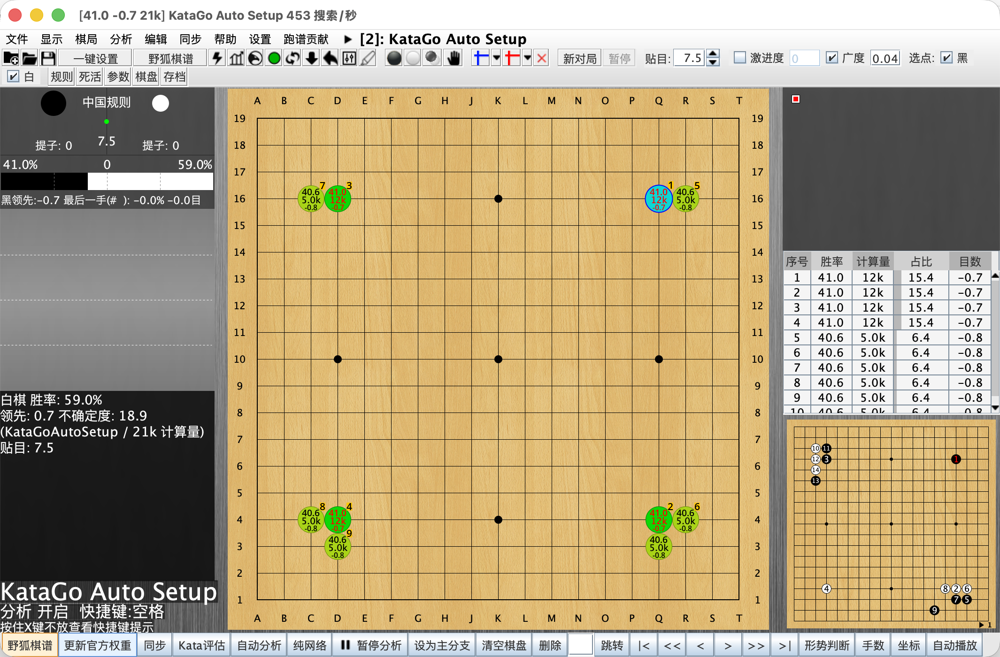

  

  
  
  
  

  <a href="README.md">中文</a> · <a href="README_EN.md">English</a> · 日本語 · <a href="README_KO.md">한국어</a>

  <strong>まだ lizzieyzy を使いたい人のために、きちんと続けて使える保守版です。</strong> 
  元のプロジェクトが長く保守されなかった結果、野狐棋譜取得で困る利用者が増えていました。この版では、まずその実用部分を直し、初回起動や KataGo 同梱もわかりやすく整えています。 
  <strong>ダウンロードして、野狐のニックネームを入力し、棋譜取得と解析を続けられます。</strong>

  <a href="https://github.com/wimi321/lizzieyzy-next/releases"><strong>Releases</strong></a>
  ·
  <a href="docs/INSTALL_JA.md"><strong>インストールガイド</strong></a>
  ·
  <a href="docs/TROUBLESHOOTING_EN.md"><strong>トラブル対応</strong></a>

> [!IMPORTANT]
> まずはこの 5 点だけ見れば大丈夫です:
> - Windows 利用者の多くは `windows64.with-katago.installer.exe` を選べば始めやすいです。これは推奨の **CPU 版** です
> - OpenCL GPU 加速を試したい場合は `windows64.opencl.installer.exe` も選べます
> - NVIDIA GPU を使っていて、より速い解析を求めるなら `windows64.nvidia.installer.exe` を選べます
> - 野狐棋譜取得では **野狐のニックネーム** を入力します。アプリが対応するアカウントを自動で見つけます
> - 主な統合パッケージには KataGo が含まれており、初回起動では自動設定を優先します

## コミュニティと現在の方針

| いまやりたいこと | まず見る場所 |
| --- | --- |
| ダウンロードしてインストールしたい | [Releases](https://github.com/wimi321/lizzieyzy-next/releases) / [インストールガイド](docs/INSTALL_JA.md) |
| バグやインストール結果を共有したい | [Support](SUPPORT.md) |
| 利用感や改善案を話したい | [GitHub Discussions](https://github.com/wimi321/lizzieyzy-next/discussions) / QQ グループ `299419120` |
| 今後の優先事項を見たい | [ROADMAP.md](ROADMAP.md) |
| 維持開発に参加したい | [CONTRIBUTING.md](CONTRIBUTING.md) |

このリポジトリは、次のような実用面を優先して保守しています。

- `lizzieyzy` を今も使っている利用者向けの主要な流れを維持すること
- 野狐棋譜取得、KataGo 同梱、初回起動のわかりやすさを保つこと
- 設定に詳しい少数者だけでなく、普通の利用者にも使いやすくすること

## Windows 利用者はここから見れば大丈夫です

**Windows** を使っているなら:

- 多くの人は **`windows64.with-katago.installer.exe`**。これは安定重視の **CPU 版** です
- OpenCL GPU 加速を試したいなら **`windows64.opencl.installer.exe`**
- NVIDIA GPU があり、速度を優先したいなら **`windows64.nvidia.installer.exe`**

上の 3 つはそれぞれ CPU 版、OpenCL 版、NVIDIA 高速版です。
NVIDIA 版は初回起動時に必要な公式 NVIDIA ランタイムをユーザーフォルダへ自動で準備してから高速解析を使えるようにします。
CPU 版、OpenCL 版、NVIDIA 版はいずれも `KataGo Auto Setup` の `Smart Optimize` を使えます。

## どれをダウンロードするか

先に図で見たい場合は、こちらを見るのが早いです。

  

| あなたの環境 | まず選ぶもの |
| --- | --- |
| Windows x64、CPU 版、推奨 | `windows64.with-katago.installer.exe` |
| Windows x64、CPU 版、インストーラ不要 | `windows64.with-katago.portable.zip` |
| Windows x64、OpenCL 版、GPU 加速を試したい | `windows64.opencl.installer.exe` |
| Windows x64、OpenCL 版、インストーラ不要 | `windows64.opencl.portable.zip` |
| Windows x64、NVIDIA GPU、より速い解析 | `windows64.nvidia.installer.exe` |
| Windows x64、NVIDIA GPU、インストーラ不要 | `windows64.nvidia.portable.zip` |
| Windows x64、自分でエンジンを設定したい、インストーラあり | `windows64.without.engine.installer.exe` |
| Windows x64、自分でエンジンを設定したい | `windows64.without.engine.portable.zip` |
| macOS Apple Silicon | `mac-arm64.with-katago.dmg` |
| macOS Intel | `mac-amd64.with-katago.dmg` |
| Linux x64 | `linux64.with-katago.zip` |

迷ったときの目安:

- Windows: どれを選ぶべきかわからない場合は `windows64.with-katago.installer.exe`
- Mac: Apple Silicon か Intel かを先に確認
- Linux: `with-katago.zip`

ざっくり言うと:

- `with-katago.installer.exe` は多くの Windows 利用者向けの CPU 版
- `opencl.installer.exe` は OpenCL GPU 加速を試したい人向け
- `nvidia.installer.exe` は NVIDIA GPU 利用者向けの高速版
- `opencl.portable.zip` は OpenCL 版の非インストール版
- `nvidia.portable.zip` は NVIDIA GPU 利用者向けの非インストール版
- `with-katago.portable.zip` は CPU 版の非インストール版
- `without.engine.installer.exe` はインストーラ経由で自分のエンジンを使いたい人向け
- `without.engine.portable.zip` は自分のエンジンを使い、インストールも省きたい人向け

## このメンテ版で改善したこと

- **野狐棋譜取得がまた使えるようになりました**
  元プロジェクトで止まっていた公開棋譜取得の流れを、また使える形に戻しています。
- **先に数字のIDを調べる必要がなくなりました**
  いまは野狐のニックネームを入力すれば、アプリが対応するアカウントを見つけて公開棋譜を取得します。
- **初回起動が楽になりました**
  まず内蔵の解析環境を準備するので、多くの利用者は最初から細かい設定をしなくて済みます。
- **KataGo の速度調整もアプリ内で進めました**
  `KataGo Auto Setup` に `Smart Optimize` を追加し、KataGo の benchmark 結果からより合いやすいスレッド数を自動で保存できます。

## 3 ステップで開始

1. [Releases](https://github.com/wimi321/lizzieyzy-next/releases) から自分の環境に合うパッケージをダウンロードします。
2. **野狐棋譜（ニックネームで取得）** の入口を開きます。
3. 野狐のニックネームを入力し、最新の公開棋譜を取得して、そのまま解析を続けます。

  

  GitHub 上で GIF の再生が遅い場合は、上の画像をクリックすると全体のアニメーションを開けます。

## 実際の画面

以下は、現在のメンテ版そのものの実画面です。下部には **野狐棋譜** と **公式重み更新** の入口が直接見えるようになっています。

  

普段よく使う入口は、最初から主画面に見えるようにしています。

| やりたいこと | 主画面で見る場所 |
| --- | --- |
| 最近の公開棋譜を取得したい | `野狐棋譜` |
| 公式 KataGo 重みを更新したい | `更新官方权重` |
| そのまま解析と復習を続けたい | `Kata評估` / `自動分析` |

## 統合パッケージに最初から入っているもの

| 項目 | 現在の値 |
| --- | --- |
| KataGo バージョン | `v1.16.4` |
| 既定の重み | `g170e-b20c256x2-s5303129600-d1228401921.bin.gz` |
| 初回起動の自動設定 | 有効 |
| 公式重みダウンロード入口 | あり |

多くの利用者にとって大事なのは、この 1 点です。

**主推薦の統合パッケージには KataGo と既定の重みが含まれているので、すぐに使い始めやすくなっています。**

## よくある質問

<strong>先にアカウント番号を知っておく必要はありますか？</strong>

不要です。野狐のニックネームを入力すれば、アプリが対応するアカウントを自動で探します。取得後の一覧にはニックネームとアカウント番号の両方が表示されます。

<strong>なぜニックネーム入力に変えたのですか？</strong>

普通の利用者はアカウント番号よりニックネームを覚えていることが多いためです。面倒な検索手順をアプリの中に戻しました。

<strong>棋譜が見つからないときは何を確認すればよいですか？</strong>

ニックネームが正しいか、そのアカウントに最近の公開棋譜があるか、一時的なネットワーク問題がないかを確認してください。

<strong>初回起動で KataGo を手動設定する必要はありますか？</strong>

多くの `with-katago` 利用者には不要です。内蔵 KataGo、重み、設定パスを自動で見つける流れを優先します。

<strong>macOS で最初にブロックされたらどうすればよいですか？</strong>

現在の macOS ビルドはまだ署名と公証を行っていません。最初に止められた場合は、[インストールガイド](docs/INSTALL_JA.md) の手順を確認してください。

## さらに見る

- [インストールガイド](docs/INSTALL_JA.md)
- [Package Overview](docs/PACKAGES_EN.md)
- [Troubleshooting](docs/TROUBLESHOOTING_EN.md)
- [Tested Platforms](docs/TESTED_PLATFORMS.md)
- [Roadmap](ROADMAP.md)
- [Contributing](CONTRIBUTING.md)
- [Changelog](CHANGELOG.md)
- [Support](SUPPORT.md)

## クレジット

- Original project: [yzyray/lizzieyzy](https://github.com/yzyray/lizzieyzy)
- KataGo: [lightvector/KataGo](https://github.com/lightvector/KataGo)
- 野狐棋譜取得の参考:
  - [yzyray/FoxRequest](https://github.com/yzyray/FoxRequest)
  - [FuckUbuntu/Lizzieyzy-Helper](https://github.com/FuckUbuntu/Lizzieyzy-Helper)
