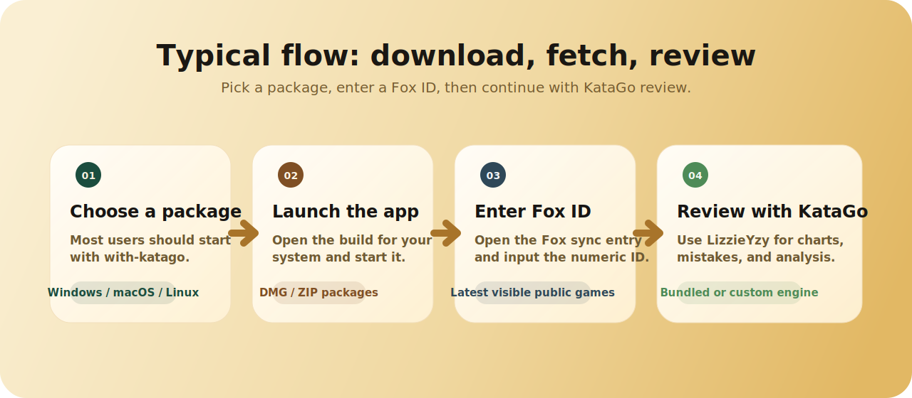

  

  
  
  
  
  

  <a href="README.md">中文</a> · <a href="README_EN.md">English</a> · <a href="README_JA.md">日本語</a> · 한국어

# LizzieYzy Next-FoxUID

**원래 LizzieYzy 에서 사실상 망가졌던 Fox 기보 동기화를 복구하고, Fox ID 중심 흐름과 배포 패키지를 다시 정리한 지속 유지보수 포크입니다.**

  <a href="https://github.com/wimi321/lizzieyzy-next-foxuid/releases">Releases</a>
  ·
  <a href="#바로-시작하고-싶다면">바로 시작</a>
  ·
  <a href="#어떤-패키지를-받아야-하나">패키지 선택</a>
  ·
  <a href="#빠른-시작">빠른 시작</a>
  ·
  <a href="#문서와-지원">문서</a>
  ·
  <a href="#참여하기">참여하기</a>

> [!IMPORTANT]
> 원래 LizzieYzy 에서는 Fox 기보 동기화가 사실상 잘 동작하지 않았습니다. 이 포크는 그 흐름을 복구하고 입력 방식도 **Fox ID** 기준으로 통일했습니다.

## 이 유지보수판이 바꾼 점

`LizzieYzy Next-FoxUID` 는 원래 `lizzieyzy` 를 지금도 실제로 쓸 수 있는 상태로 유지하기 위한 포크입니다.

이 저장소는 완전히 새로운 앱을 다시 만드는 프로젝트가 아닙니다. 기존 LizzieYzy 사용자가 지금 환경에서도 계속 설치하고, 기보를 가져오고, 분석할 수 있도록 유지보수하는 데 초점을 둡니다.

주로 손본 부분은 다음과 같습니다.

- 망가졌던 Fox 기보 동기화를 다시 사용할 수 있게 복구
- UI 와 문서의 용어를 **Fox ID** 로 통일
- 배포 패키지를 플랫폼과 용도 기준으로 다시 정리
- 설치와 문제 해결 문서를 이 저장소에 모아서 계속 갱신

## 바로 시작하고 싶다면

| 지금 필요한 것 | 먼저 볼 곳 |
| --- | --- |
| 바로 쓸 수 있는 패키지 | [Releases](https://github.com/wimi321/lizzieyzy-next-foxuid/releases) 에서 `with-katago` 선택 |
| 직접 엔진을 관리하는 패키지 | [Package Overview (English)](docs/PACKAGES_EN.md) 를 보고 `without.engine` 선택 |
| 실제 기기 검증 상태 확인 | [Tested Platforms](docs/TESTED_PLATFORMS.md) |
| 설치나 첫 실행 문제 해결 | [설치 가이드](docs/INSTALL_KO.md) 와 [Troubleshooting (English)](docs/TROUBLESHOOTING_EN.md) |
| 설치 성공 / 실패 보고 | [Installation Report](https://github.com/wimi321/lizzieyzy-next-foxuid/issues/new?template=installation_report.yml) |
| 버그 제보나 개선 제안 | [Issues](https://github.com/wimi321/lizzieyzy-next-foxuid/issues) / [Discussions](https://github.com/wimi321/lizzieyzy-next-foxuid/discussions) |

## 현재 상태

| 상태 | 설명 |
| --- | --- |
| Fox 기보 동기화 | 복구 완료. **Fox ID** 로 최신 공개 기보를 가져오는 흐름 유지 |
| 배포 패키지 | Windows / macOS / Linux 기준으로 다시 정리 |
| 통합 패키지 | `with-katago` 계속 제공 |
| 문서 | 설치, 문제 해결, 패키지 설명, 유지보수 문서를 정리 |
| 실기기 검증 | Apple Silicon 은 유지보수자가 확인. 다른 플랫폼은 계속 보고 수집 중 |
| 유지보수 방식 | 일회성 핫픽스가 아니라 계속 유지보수하는 포크 |

## 스크린샷

## 어떤 패키지를 받아야 하나

> [!TIP]
> 대부분의 사용자는 `with-katago` 를 먼저 고르면 됩니다. `without.engine` 은 엔진을 직접 관리하려는 경우에만 고르세요.

  

| 환경 | 추천 패키지 | Java | KataGo | 추천 대상 |
| --- | --- | --- | --- | --- |
| Windows x64 | `windows64.with-katago.zip` | 포함 | 포함 | 다운로드 후 바로 쓰고 싶은 경우 |
| Windows x64 | `windows64.without.engine.zip` | 포함 | 없음 | 엔진을 직접 관리하는 경우 |
| Windows x86 | `windows32.without.engine.zip` | 없음 | 없음 | 구형 환경이나 호환성 목적 |
| macOS Apple Silicon | `mac-arm64.with-katago.dmg` | App 내장 | 포함 | M 시리즈 Mac |
| macOS Intel | `mac-amd64.with-katago.dmg` | App 내장 | 포함 | Intel Mac |
| Linux x64 | `linux64.with-katago.zip` | 포함 | 포함 | Linux 데스크톱 |
| 고급 사용자 | `Macosx.amd64.Linux.amd64.without.engine.zip` | 없음 | 없음 | 완전 수동 구성 |

관련 링크:

- [Releases](https://github.com/wimi321/lizzieyzy-next-foxuid/releases)
- [Package Overview (English)](docs/PACKAGES_EN.md)
- [Tested Platforms](docs/TESTED_PLATFORMS.md)

## 보통은 이렇게 사용합니다

  

대부분의 사용자는 보통 다음 순서로 사용합니다.

1. 내 시스템에 맞는 패키지를 다운로드합니다
2. 앱을 실행하고 Fox 기보 가져오기 메뉴를 엽니다
3. 숫자로 된 **Fox ID** 를 입력해 공개 기보를 가져옵니다
4. 그대로 KataGo 분석과 복기를 이어갑니다

## 빠른 시작

1. [Releases](https://github.com/wimi321/lizzieyzy-next-foxuid/releases) 에서 내 시스템에 맞는 패키지를 다운로드합니다.
2. 가장 빠르게 시작하려면 `with-katago` 를 선택합니다.
3. 앱을 실행하고 Fox 기보 가져오기 메뉴를 엽니다.
4. 숫자로 된 **Fox ID** 를 입력해 최신 공개 기보를 가져옵니다.
5. 첫 실행이 OS 에 의해 막히면 [설치 가이드](docs/INSTALL_KO.md) 를 확인합니다.

## 무엇을 할 수 있나

| 용도 | 현재 가능한 기능 |
| --- | --- |
| 기보 가져오기 | Fox ID 로 최신 공개 기보 가져오기 |
| 대국 복기 | 승률 변화, 집 차이 변화, 실수 통계, 시각화 |
| 빠른 분석 | KataGo analysis mode 기반 병렬 분석 |
| 배치 처리 | 여러 SGF 일괄 분석 |
| 엔진 비교 | 듀얼 엔진 비교와 엔진 대 엔진 대국 |
| 부분 연구 | 사활 / 부분 국면 연구 보조 |
| 기타 | 판 동기화, 형세 판단 등 원 프로젝트의 주요 기능 |

## 원 프로젝트와의 차이

| 항목 | 원래 LizzieYzy | Next-FoxUID |
| --- | --- | --- |
| Fox 동기화 | 많은 사용자에게 사실상 고장남 | 복구됨 |
| 입력 명칭 | UID / 사용자명 표현이 섞여 있음 | Fox ID 로 통일 |
| 배포 구조 | 어떤 파일을 받아야 할지 어려움 | 플랫폼 / 용도 기준으로 재정리 |
| macOS 배포 | 예전 방식이 다소 혼란스러움 | `.dmg` 중심, Apple Silicon / Intel 분리 |
| Windows x64 | 목적별 구분이 약함 | `with-katago` 와 `without.engine` 동시 제공 |
| 유지보수 | 거의 정체 | 지속 유지보수 중 |

## 원 프로젝트에서 넘어오는 경우

- Fox 기보 가져오기 흐름은 이제 Fox ID 기준으로 정리되어 있습니다
- 사용자명 검색은 현재 지원 경로가 아닙니다
- Windows x64 는 `with-katago` 와 `without.engine` 을 둘 다 유지합니다
- macOS 는 추가 `.app.zip` 대신 `.dmg` 중심으로 제공합니다
- 이 저장소는 임시 수정본이 아니라 계속 유지보수하기 위한 포크입니다

## 문서와 지원

- [설치 가이드](docs/INSTALL_KO.md)
- [Troubleshooting (English)](docs/TROUBLESHOOTING_EN.md)
- [Package Overview (English)](docs/PACKAGES_EN.md)
- [Development Guide (English)](docs/DEVELOPMENT_EN.md)
- [Tested Platforms](docs/TESTED_PLATFORMS.md)
- [Support](SUPPORT.md)
- [Changelog](CHANGELOG.md)

## 자주 묻는 질문

<strong>왜 사용자명 검색을 없앴나요?</strong>

사용자 입장에서도 헷갈렸고 유지보수도 어려웠기 때문입니다. 이 포크에서는 Fox ID 기준으로 통일합니다.

<strong>왜 macOS 에서 app.zip 대신 dmg 중심으로 바꿨나요?</strong>

대부분의 사용자는 바로 설치할 수 있는 형식을 원하기 때문입니다.

<strong>내 플랫폼이 Tested Platforms 에 없으면 어떻게 하나요?</strong>

먼저 [Tested Platforms](docs/TESTED_PLATFORMS.md) 와 [설치 가이드](docs/INSTALL_KO.md) 를 확인하세요. 성공이든 실패든 설치 보고를 남겨주면 프로젝트 품질 향상에 직접 도움이 됩니다.

## 로드맵

- [x] Fox 기보 동기화 복구
- [x] Fox ID 기준 흐름으로 통일
- [x] 멀티플랫폼 배포 패키지 재정리
- [x] Intel Mac 패키징 복구
- [x] 설치 / 문제 해결 문서 보강
- [ ] 실기기 설치 보고 더 확보
- [ ] 스크린샷과 소개 자료 추가 개선
- [ ] 한국어 / 일본어 보조 문서 확장

## 참여하기

지금 특히 도움이 되는 기여는 다음과 같습니다.

- Windows / Linux / Intel Mac 실기기 설치 보고
- Fox 동기화 호환성 제보
- 문서, 번역, UI 문구 개선
- 패키징과 릴리스 흐름 수정
- 범위가 작은 코드 수정

링크:

- [Contributing Guide](CONTRIBUTING.md)
- [Code Of Conduct](CODE_OF_CONDUCT.md)
- [Security Policy](SECURITY.md)
- [Support](SUPPORT.md)
- [Issues](https://github.com/wimi321/lizzieyzy-next-foxuid/issues)
- [Discussions](https://github.com/wimi321/lizzieyzy-next-foxuid/discussions)

## 크레딧

- Original project: [yzyray/lizzieyzy](https://github.com/yzyray/lizzieyzy)
- Upstream GUI base: [featurecat/lizzie](https://github.com/featurecat/lizzie)
- Engine: [lightvector/KataGo](https://github.com/lightvector/KataGo)

## 라이선스

원 프로젝트의 라이선스를 그대로 따릅니다. 자세한 내용은 [LICENSE.txt](LICENSE.txt) 를 참고하세요.
